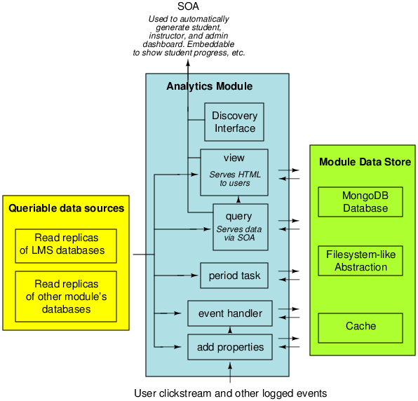
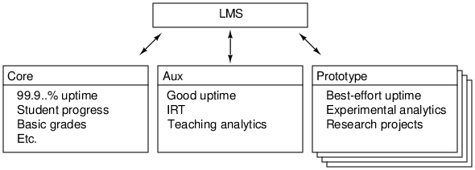
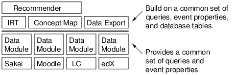

edX Insights
===========

This is a development version of an analytics framework for the edX
infrastructure. It will replace the ad-hoc analytics used in the
software previously. The goal of this framework is to define an
architecture for simple, pluggable analytics modules. The architecture
must have the following properties:

1. Easy to use. Professors, graduate students, etc. should be able to
write plug-ins quickly and easily. These should be able to run in the
system without impacting the overall stability. Results should be
automatically shown to customers. 
2. The API must support robust, scalable implementations. The current
back-end is not designed for mass scaling, but the API for the modules 
should permit e.g. sharding in the future. 
3. Reusable. The individual analytics modules should be able to use
the results from other modules, and people should be able to build on
each others' work.
4. Interoperable. We would like the framework to be sufficiently
generic to be useable outside of edX.
5. Cross-scope. There should be a smooth path from off-line analytics,
to on-line batched analytics (e.g. for an instructor dashboard), to
on-line realtime analytics (e.g. for the system to react to an event
the analytics detects).

Architecture
------------

A block diagram of the overall system is: 

The learning management streams events to the analytics framework. In
addition, the modules in the framework will typically have access to
read replicas of production databases. In practice, a lot of analytics
can be performed directly from the LMS databases with a lot less
effort than processing events.

A rough diagram of a single analytics module is: 

Each module in the analytics framework is an independent Python
module. It has its own Mongo database, a filesystem abstraction, as
well as a cache. In addition, it can have access to read-replicas of
production databases, and in the near future, it will have access to
read replicas of other module's databases.

Note that all of these are optional. A hello world module could be as
simple as defining a single view:

    @view()
    def hello_world():
       return "<html>Hello world!</html>"

If you wanted the view to be per-user, you could include a user
parameter:

    @view()
    def hello_world(user):
       return "<html>Hello "+user+"</html>"

The views and queries are automatically inspect for parameters, and
the system will do the right thing. If you would like to have a
per-module database, simply take a db parameter. Etc.

To understand the system, the best place to start is by reading the
module which defines testcases -- the file
modules/testmodule/__init__.py. Next place is to look at the code for
the decorators. Final place is for the main views and dashboard.

Installing
----------

Follow the instructions in INSTALL.md

If installed for development, the advertised views and queries for
the test module will be at:

    http://127.0.0.1:8000/static/index.html

Building on top of the framework
--------------------------------

To build on top of the framework, you will need several things: 
* A log handler which can stream the events out over an SOA. The ones
  we wrote for edX are available at:
    https://github.com/edx/loghandlersplus
* A way of piping these events into the analytics framework. The
  version we wrote for edX is available at:
    https://github.com/edx/djeventstream
  On a high level, this is a module which sends Django signals of type
  djeventstream.signals.event_received. The events are JSON
  dictionaries. The event handler can handle either dictionaries,
  lists of dictionaries, or JSON-encoded string representations of
  both.
* A way of embedding the analytics in your LMS based on the SOA. 
* Potentially, some set of analytics modules. At the very least, you
  should define appropriate (TBD) properties to ornament your events
  with and appropriate queries (TBD) to get data out of your
  read-replica databases, so that modules written by other folks can
  get at your data in a generic way. The best way to understand how
  to do this is to read test cases in modules/testmodule/__init__.py

A very minimal example of how to build applications on top of this
framework is in the example directory.

Using Analytics Externally (djobject)
-------------------------------------

djobject.py has an abstraction for accessing analytics both locally
(function calls) and remotely (RPC). This is a standard Python
object. All of the standard Python introspection of the methods in
this object works. 

This is, in particular, useful for off-line analytics. You have access
to the raw data, analyzed data, and queries defined by other analytics
modules. For example, given a time_on_task module, you could call
event.time_on_task to get the time between that event and the
following event. Or you could call query.irt(problem) to get the IRT
parameters for that problem.

When using analytics remotely, there are issues of security and
permissions. Specifically, a sysadmin might want to see an analytic
per-course/per-student. An instructor of that course might want to
have that fixed to the course (so it transforms into a per-student
analytic). djobject's transform_embed defines a DSL for restricting
permissions to analytics, as well as for fixing specific commandline
parameters. 

There is an issue of network reliability and timeouts when access
remotely. This is planned to be handled by being able to set timeouts
on djembed objects.

Shortcuts/invariants
--------------------

* Template rendering is a hack. 
* Duplicate events/downtime is not handled. 
* At present, events come into the system through an SOA. The tracking
  framework is modified to use a Python HTTP logger, which are
  received by the framework. For most events, this should be replaced
  with something asynchronous, as well as queued, such as Twitter
  storm.
* The analytics have limited isolation from each other. They can run
  on seperate servers, but with multiple modules on one server, there
  is no isolation. The architecture supports running each module in
  its own sandbox. This should not be broken (e.g. by having direct
  calls across modules).
* Right now, all functions must be process-safe (the function gets
  called multiple times, although in different memory spaces). Some
  folks would like to write an analytic that runs in a single process
  without worrying about thread safety (e.g. while(true) {
  get_event(); handle_event(); }). The API is designed to support
  this, but this is not implemented.
* The analytics framework has no way to generate new events. This would be 
  useful for chaining analytics. This is trivial to add. 
* There are no filters. E.g. an event handler cannot ask for all video
  events. This is high priority. This is trivial to add. 

Desired Modes of operation
--------------------------

1. Hard realtime. When an event comes in, it is synchronously
   processed. The caller knows that by the time the event returns, it
   can extract results from the analytic.
2. Soft realtime. There is a queue, but processing is fast enough that
   the queue is assumed to be nearly empty.
3. Queued. There is a queue with potentially a significant backlog. 
4. Batched. Processing runs at e.g. 5 minute or 1 day intervals. 
5. Off-line. There is a database populated with data, and the data is
   analyzed by hand.

For developing the system, hard realtime is the most critical, and
we'd like to keep the invariant that it works. Next most useful is
either queued or batched. 

Sharding
--------

Some types of analytics support sharding per-resource (e.g. number of
views) or per-student (e.g. time spent in course). Some require global
optimization and cannot be sharede (e.g. IRT). This is something we'll
need to eventually think about, but this is a 2.0 feature. Note that
the current decorator design pattern does not help -- it merely helps
define a storage API. A statistic like class rank may be per-user, but
require data from all users. 

Useful pointers
---------------

Pivotal Tracker has a set of possible metrics of mixed quality. The
wiki has another set of possible metrics. The most useful metrics
we've found were in competing systems and in publications from the
research community.

Gotchas
-------

* For events to flow in, a decorator in core.views must be
  called. This must be iported from the main appliction. 
* Number 1 bug: Python path issues if you have this installed and are
  developing from source.

Product Backlog
---------------

1. Add support for asynchronous views. When the client issues a
   request for a view which takes a while to calculate, there should
   be visual feedback.
2. Move views into an iframe. 
3. Create appropriate userspace. We need higher-level functions to
   extract information from events.
4. Find ways to handle and drop duplicate events. 
5. Find ways to handle robust, queued events
6. The API for genetic event properties (e.g. event.actor) should
   support namespaces (e.g. event.tincan.actor) and generic dispatch
   (e.g. one module defines event.tincan.actor for events from Sakai,
   and another for events from edX, and the right one gets
   called). Note that, in the short term, no namespace is required
   (for being able to access data), while namespaces is only important
   (for clean abstractions).
7. Better error handling and escalation. 
8. Better off-line support. 
9. Extend the property API to support not just events. We'd like to
   have things like problem.difficulty (from IRT), or video.rewinds,
   etc.
10. Make the types of parameters passed (user, resource, etc.) static,
    rather than dynamic.
11. Better batch processing. We add a module. It should be able to get
    all past events.

Other useful next steps
-----------------------

1. Test infrastructure. We should have a dummy dataset and database,
and be able to confirm output of all queries.
2. Development data. We need sample outputs for all queries for when
the DB is not available for UI development (some of this exists). 

Needs of edX
------------

edX currently has many sources of data: 

1. User tracking events. The software has a middleware layer which
   captures all data (within reason) that the user sends to the
   server. In addition, the server is instrumented, where necessary,
   to capture context for this (e.g. for a problem submission, we also
   need to capture the random number seed used to generate that
   problem). The JavaScript is instrumented to capture most of what
   the user does client-side (e.g. textbook page turns or video
   scrubs). These events are captured in a Python logger, and streamed
   into this framework. The structure of these events is
   (intentionally) quite simple and general. We are ontology-agnostic.
2. Databases. The application-layer of the analytics framework has or
   will have access to databases through read replicas. 
3. External services used for surveys and mailings. This is not
   currently integrated.
4. Course data. Most of this is in the read replica databases, but for
   some courses, this lives in github repositories of XML files. This
   is not currently integrated.
5. Course-specific services (e.g. CS50 forums, Berkeley graders, etc.)
6. E-mails to course staff. 
7. Anecdotal interactions. 

We need to be able to aggregate these into useful information for
students, instructors, researchers, marketers, etc.

Architecture Expansions
=======================

This section lists some long-term architectural design goals of the
system. 

The architecture is explicitly designed to eventually scale to running
different analytics on different servers. edinsights.core.djobject
(TODO: change to insights.core) provides a query object and a view
object, which can be used to access queries and views in an identical
way, regardless of whether or not there is a network in between. In
the future, we would like to support an architecture where we have
multiple analytics servers:

This way, we can have production-grade code on e.g. a critical server
which keeps student profile/grading/etc. information, while still
maintaining prototype analytics servers, which may be on-line more
intermittently. In order to support this, the djobject abstraction
would have to be extended to support multiple servers. In addition,
the current way the analytics embed in the courseware would have to
change substantially.

In addition, the architecture is designed to scale to sharing
analytics between LMSes. A potential structure for this is: 

Here, each instance would have a data layer module. This module would
translate the data generate by the particular LMS into a common
representation. Analytics would be built on top of that common
representation. 

We would like to also support FERPA-compliance. This could be built in
one of two ways. Per-school stacks, including analytics: 

Split analytics: 

The API supports either. Building out back-end support for either
would be substantial.

Other edX Code
==============

This code was developed as part of edX. See
[code.edx.org](http://code.edx.org/) for other code from edX.

License
-------

The code in this repository is licensed under version 3 of the AGPL unless
otherwise noted.

Please see ``LICENSE.txt`` for details.

How to Contribute
-----------------

Contributions are very welcome. The easiest way is to fork this repo, and then
make a pull request from your fork. The first time you make a pull request, you
may be asked to sign a Contributor Agreement.

Reporting Security Issues
-------------------------

Please do not report security issues in public. Please email security@edx.org

Mailing List and IRC Channel
----------------------------

You can discuss development specific to this package, as well as
general learning analytics and educational datamining on the
[insights-dev Google Group](https://groups.google.com/forum/#!forum/insights-dev). General
edX platform discussion can happen on the [edx-code Google Group](https://groups.google.com/forum/#!forum/edx-code) or in the
`edx-code` IRC channel on Freenode.
