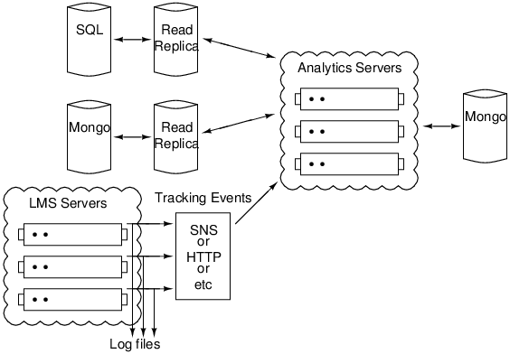

djanalytics
===========

This is a development version of an analytics framework for the edX
infrastructure. It will replace the ad-hoc analytics used in the
software previously. The goal of this framework is to define an
architecture for simple, pluggable analytics modules. The architecture
must have the following properties:

1. Easy to use. Professors, graduate students, etc. should be able to
write plug-ins quickly and easily. These should be able to run in the
system without impacting the overall stability. Results should be
automatically shown to customers. 
2. The API must support robust, scalable implementations. The current
back-end is not designed for mass scaling, but the modules should be. 
3. Reusable. The individual analytics modules should be able to use
the results from other modules, and people should be able to build on
each others' work.

Architecture
------------

edX currently has many sources of data: 

1. User tracking events. The software has a middleware layer which
   captures all data (within reason) that the user sends to the
   server. In addition, the server is instrumented, where necessary,
   to capture context for this (e.g. for a problem submission, we also
   need to capture the random number seed used to generate that
   problem). The JavaScript is instrumented to capture most of what
   the user does client-side (e.g. textbook page turns or video
   scrubs). These events are captured in a Python logger, and streamed
   into this framework.
2. Databases. The application-layer of the analytics framework has or
   will have access to these through read replicas. While virtually
   all of the information is in the events, in practice, most
   analytics can be performed from just the databases. This is
   generally both much easier, and less sensitive to breaking when the
   software changes.
3. External services used for surveys and mailings. This is not
   currently integrated.
4. Course data. Most of this is in the read replica databases, but for
   some courses, this lives in github repositories of XML files. This
   is not currently integrated.
5. Course-specific services (e.g. CS50 forums, Berkeley graders, etc.)
6. E-mails to course staff. 
7. Anecdotal interactions. 

A block diagram of the overall system is: 

Each module in the analytics framework has its own Mongo database, as
well as a filesystem abstraction. In addition, in the near future, it
should have read-only access to the DBs associated with other modules.

The module consists of a set of functions which can be decorated as: 
* Event handlers. These receive tracking events. 
* Views. These render HTML to be shown to the user
* Future: AJAX calls associated with events. 
* Queries: These render machine-readable results through an SOA. 
* Future: CRON tasks

To understand the system, the best place to start is by reading a
sample module. Next place is to look at the code for the
decorators. Final place is for the main views and dashboard. 

Installing
----------

Note: These instructions are obsolete. See INSTALL.md for interrim instructions

    apt-get install python-pip python-matplotlib python-scipy emacs mongodb apache2-utils python-mysqldb subversion ipython nginx git redis-server
    pip install -r requirements.txt
    
    git clone git@github.com:MITx/analytics-experiments.git
    cd analytics-experiments
    git checkout pmitros/api-devel
    cd anserv
    python manage.py syncdb
    python manage.py syncdb --database=local
    [If you want real data, create an override_settings.py, pointing to your 
    SQL database, and disable DUMMY_MODE]
    python manage.py runserver localhost:9022

For a half-broken dashboard, go to: 

    http://127.0.0.1:9022/static/dashboard.html

To see a listing of modules, go to: 

    http://127.0.0.1:9022/probe

Then 

    http://127.0.0.1:9022/probe/view

Etc. 

Writing a New Module
--------------------
Modules should be placed in the modules/[module_name]

Each module can have decorators: 

    @cron(time_in_seconds)

Runs periodically. 

To declare a new view (human-readable HTML), decorate with: 

    @view(name="User_Activity", 
        category="global", 
        args=['db','fs'], 
        description="Plot of per-day user activity")

If any parameters to the decorator are omitted, the system will make a
best guess. Parameters to the function are passed a keyword args, as
specified by the args parameter.

@query will have the same syntax as @view, although at the moment, the
code is lagging.

@memoize(t) tells the system not to rerun a query for 't'
seconds. Right now, it breaks some of the logic for guessing category,
etc. It needs to be modified to use decorator.decorator so it doesn't
drop function metainformation.

See examples for syntax. 

Please be aware that the exported API is quite minimal. 

Shortcuts/invariants
--------------------

* Static file handling is not there yet. 
* Template rendering is a hack. 
* Duplicate events/downtime is not handled. 
* At present, events come into the system through an SOA. The tracking
framework is modified to use a Python HTTP logger, which are received
by the framework. For most events, this should be replaced with
something asynchronous, as well as queued.
* The analytics have no isolation from each other. The architecture
supports running each module in its own sandbox. This should not be
broken (e.g. by having direct calls across modules).
* Right now, all functions must be re-entrant. Some folks would like to
write an analytic that runs in a single process without worrying about
thread safety (e.g. while(true) { get_event(); handle_event(); }). The
API is designed to support this, but this is not implemented.
* The analytics framework has no way to generate new events. This would be 
useful for chaining analytics.
* There are no filters. E.g. an event handler cannot ask for all video events. 
* We are either copying code from the main mitx repo (models.py,
  mitmako) or importing. We should figure out a better way to handle
  this.

Modes of operation
------------------

1. Hard realtime. When an event comes in, it is synchronously
processed. The caller knows that by the time the event returns, it can
extract results from the analytic.
2. Soft realtime. There is a queue, but processing is fast enough that
the queue is assumed to be nearly empty.
3. Queued. There is a queue with potentially a significant backlog. 
4. Batched. Processing runs at e.g. 5 minute or 1 day intervals. 

Analytics can be per-student, per-resource, or global. They may also
be per-course or per-university, but this is architecturally brittle,
and not recommended (although likely unavoidable).

For developing the system, hard realtime is the most critical, and
we'd like to keep the invariant that it works. Next most useful is
either queued or batched. 

Sharding
--------

Some types of analytics support sharding per-resource (e.g. number of
views) or per-student (e.g. time spent in course). Some require global
optimization and cannot be sharede (e.g. IRT). This is something we'll
need to eventually think about, but this is a 2.0 feature. Note that
the current decorator design pattern does not help -- it merely helps
define a storage API. A statistic like class rank may be per-user, but
require data from all users. 

Useful pointers
---------------

Pivotal Tracker has a set of possible metrics of mixed quality. The
wiki has another set of possible metrics. The most useful metrics
we've found were in competing systems and in publications from the
research community.

Product Backlog
----------

1. Add support for asynchronous views. When the client issues a
request for a view which takes a while to calculate, there should be
visual feedback.
2. Move views into an iframe. 
3. Create appropriate userspace. We need higher-level functions to
extract information from events.
4. Find ways to handle and drop duplicate events. 
5. Find ways to handle robust, queued events

Other useful next steps
-----------------------

1. Test infrastructure. We should have a dummy dataset and database,
and be able to confirm output of all queries.
2. Development data. We need sample outputs for all queries for when
the DB is not available for UI development (some of this exists). 
